# Introduction

Hurray! This is the next step of working with encoder&decoder and convolutional layers. At this topic i am going to create a functional telegram bot, which will be able to work with user~s photos and find the most similar to them from database.

If you have not seen the previous part of my project, you should follow this [link](https://github.com/DmitryIo/animefaces) to get know about how all this works.

Ready? Go!

# Concepts

Bots are very popular today and their popilarity increases fastly. The most popular platform for implementation bots is Telegram. And that is exactly why i have chosed it.

Telegram provides useful API for their bots. And the library for working with it is [`pyTelegramBotAPI`](https://github.com/eternnoir/pyTelegramBotAPI). It is an intuitive thing, and i like it very much.

# Implementation

***1 Step***

Here we go! The first step of creating any telegram bot is to make an introduction. This is an example of how it works:

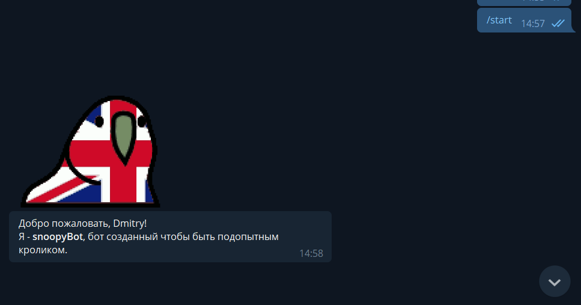

It takes from users data his name and send response by command `/start`, `Привет`, `Hello` and etc.

***2 Step***

Ok. Now the bot is able to answer first command. The next goal is to make an interactive bars for communicating with user. 

I have decided to make 3 bars: 'Random number', 'How are you?' and the third one is a secret at that moment. We will talk about the third later!

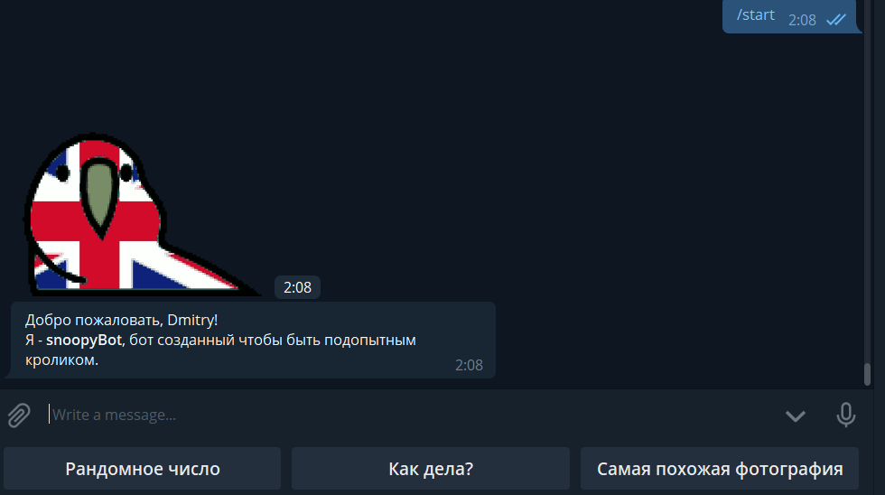

If you push on `Как дела?` the bot will answer you with two inline buttons!

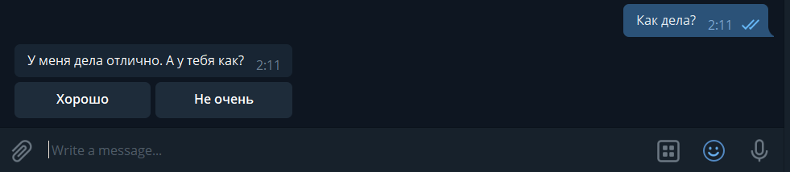

You can chose your answer and then the bot will send you another one message. It is done because of `callback_querry_handler` which detects any callbacks in the system. When you send to bot everything, the callback of your movement is processed by bot and then he decides what to do next. 

`This is a fun functioality of my bot. He can send you random number if you want`

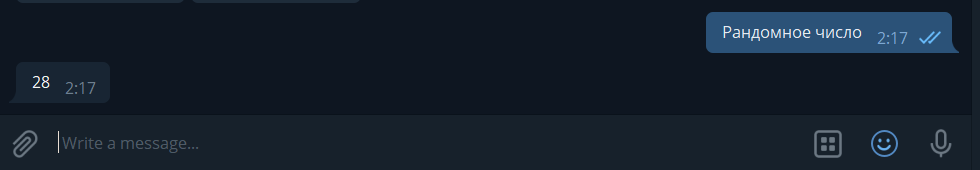

***3 Step***
BIG DEAL!

Ok, it is enough for funny features and now i am going to make something useful. The first thing i am going to talk about is [MongoDB](https://www.mongodb.com/). This is one of the most powerful cloud databases for small projects. Mongo provides programmers wide spectre of functions and things which are very helpful for project implementation. I am going to use FreeMongoCloud to create database of users. Working with MongoDB API is described in this [file](mongodb.py).

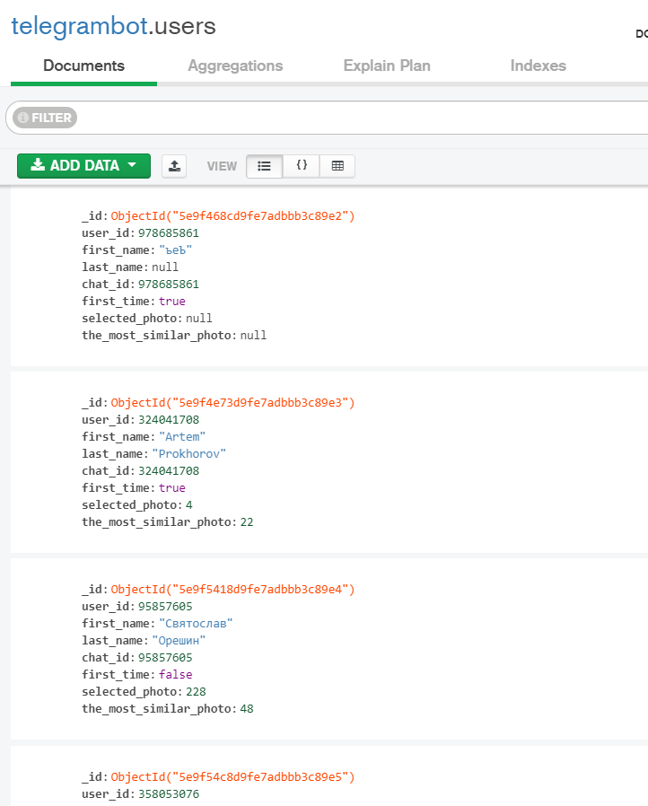

Great! Now i can save data of users and then make some operations with their data. There are some fields like `name`, `surname`, `id` and etc.

***4 Step***

At this step i am going to implement chosing photo from database(db is described in the previous github topic) and then finding the most similar to this photo another one. 

How can we count "similarity"? Ok, it is not a problem. There is a very strong mathematics method which is called `Cosine_Similarity`. 
Here is formula: 

It is just vectors scalar product divided by l2 norm(Euclid distance) 

There is one way to get vector of image and that is exactly why i have taught my encoder to provide me vector. There is 3-d channel image and encoder converts it into a 256-dimentional space. When we have two 256-dim vectors we can apply them `Cosine_Similarity`. The similarity lays between 0.0 and 1.0. The best score is 1.0 and that means that pictures are the same because of their same vectors.

Here is how can vector look like in 256-dimentional space and the image becomes something like this: 

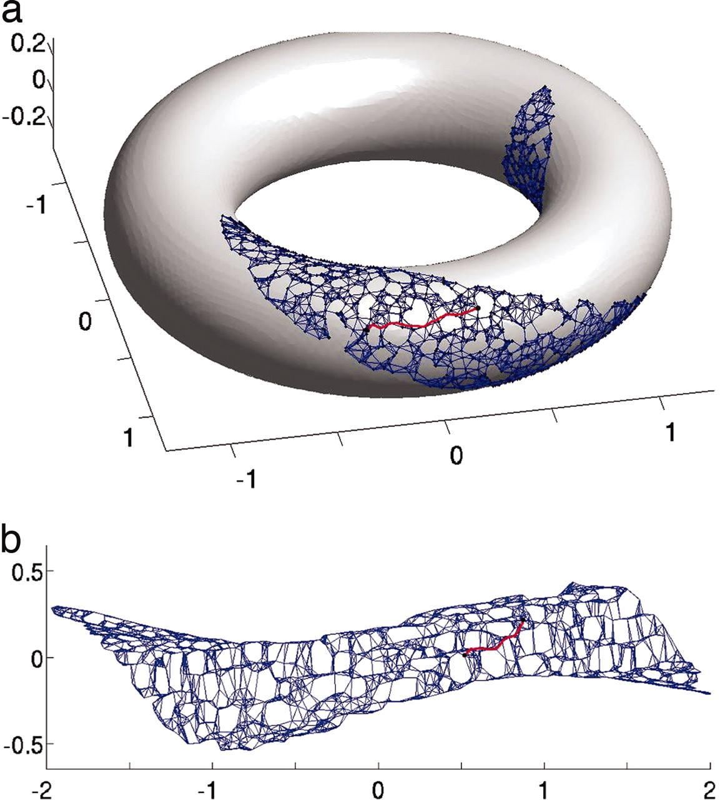

I passed the path of mathematics where is described how we can teach computer to make some predictons or(like in our case) convert things which are understandable by human into things which are understandable by programm. But the main idea is to decrease loss function by gradient descent which in my case looks like:

`Loss function:`

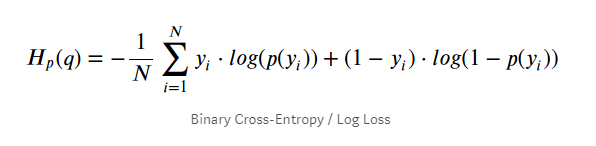

`Gradient descent:`

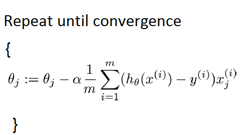

Ok! Now lets code our bot to find the most similar photo by chosing it in database. Here how it works in my bot:

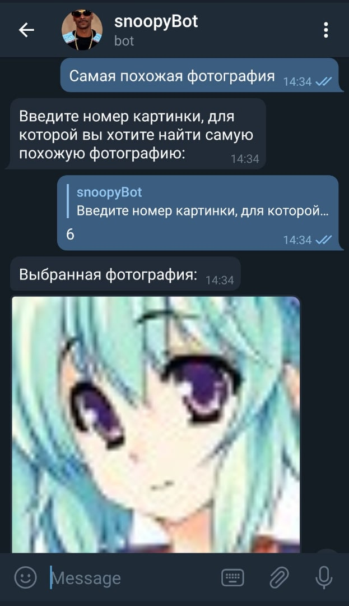

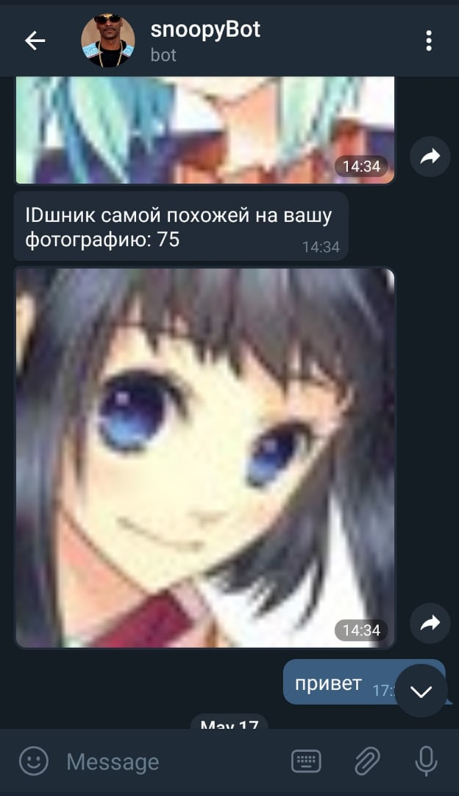

Great! We are able to find the most similar images in our database between each other. But what if we want to upload new photos and find similar to them?

***5 Step***

There is last goal to implement our bot. His last function is to find the most similar photo by uploaded users photo. Here were some difficulties, because user can upload photo with any size but encoder demends only 64x64 size of picture. Now here helps [PIL library](https://pillow.readthedocs.io/en/stable/) with method resize which is an incredible thing! It provides resized image saving the most important patterns of pixels. 

Here is how this works:

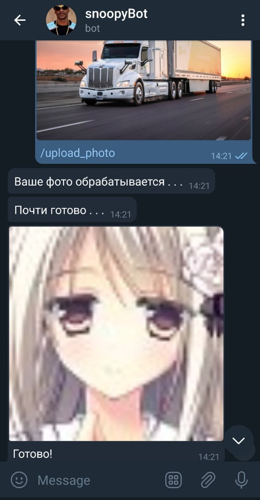

# Conclusion

I have made a telegram bot and now it can solve some tasks:

  a) It is able to make humanisation of some pictures.
  
  b) It is able to save most important things of the picture and then convert it into anime. 
  
  c) This bot will provide you some new avatars and if you want you can find the most similar to them.
  
  d) It has many prospects in development and passing the next level.
  
I can rotate this encoder&decoder model into any sides and learn any representations of different thing. Model can detect cars, planes, humans at the photos and make decision. But this is going to be in the future. Thank you for your attention!  
